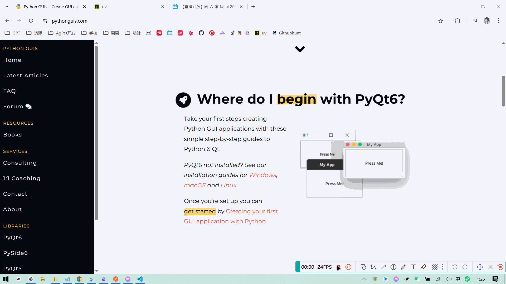

# ✨ **ClipTranslate - Clipboard Translation Tool** ✨

## 🚀 **Project Overview**

ClipTranslate is a convenient Windows desktop translation tool that allows users to quickly translate the text content in their clipboard into Chinese or English using global hotkeys. The original text and its translation are displayed in a separate window.

ℹ️ **Development Notes**

> This project is developed and tested using Claude.

## 🔧 **Key Features**

1️⃣ Trigger translation via global hotkeys

2️⃣ Automatically retrieve clipboard text content

3️⃣ Use Alibaba Cloud's Qianwen Translation Model API for translation

4️⃣ Use a general chat large model API for translation

5️⃣ Display both original text and translation in a separate window

📌 **Related Links**

💰 Qianwen Model Pricing:  
https://help.aliyun.com/zh/model-studio/machine-translation

🔑 Get API Key:  
https://help.aliyun.com/zh/model-studio/get-api-key?spm=a2c4g.11186623.0.0.210766518NP6kD


## 📥 **Installation Steps**

> This project is managed using `uv`. You can refer to the [official manual](https://docs.astral.sh/uv/) to learn how to install and use `uv`.

1️⃣ Clone or download this repository

2️⃣ Install dependencies

3️⃣ Run the application

```bash
$ git clone https://github.com/xyl2024/ClipTranslate.git
$ cd ClipTranslate
$ uv sync
$ uv run src/main.py
```

## ⚙️ **First-time Setup**

1️⃣ After running the application, find the ClipTranslate icon in the system tray

2️⃣ Right-click the icon and select "Settings"

3️⃣ Enter your Alibaba Cloud API key/Chat model API key

4️⃣ Customize the translation hotkeys

5️⃣ Click "Save" to complete the setup

## 💡 **How to Use**

1️⃣ Copy the text you want to translate (Ctrl+C)

2️⃣ Press the configured hotkey:  
   - F2 to translate to Chinese  
   - F4 to translate to English

3️⃣ The translation window will automatically display, showing both the original and translated text

4️⃣ Click the "Copy Translation" button to copy the translation

5️⃣ Press the ESC key or click the close button to hide the window

6️⃣ Double-click the system tray icon to show/hide the translation window

🎥 Example:




## 📂 **Configuration File**

The configuration file is located at `HOME/.cliptranslate/config.json`:

```json
{
    "hotkey_to_chinese": "f2",
    "hotkey_to_english": "f4",
    "chinese_threshold": 300,
    "english_threshold": 1000,
    "translator_type": "chat",
    "qwen_api_key": "sk-************************************************",
    "qwen_api_url": "https://dashscope.aliyuncs.com/compatible-mode/v1/chat/completions",
    "qwen_api_model": "qwen-mt-plus",
    "chat_api_key": "sk-************************************************",
    "chat_api_url": "https://api.siliconflow.cn/v1/chat/completions",
    "chat_api_model": "Qwen/Qwen3-8B"
}
```

## 📝 **Log Files**

Logs are located at `HOME/.cliptranslate_logs`

## ⚠️ **Cautions**

❗ This translation service relies on large models and may incur API usage fees

❗ The global hotkey functionality is only available on Windows
